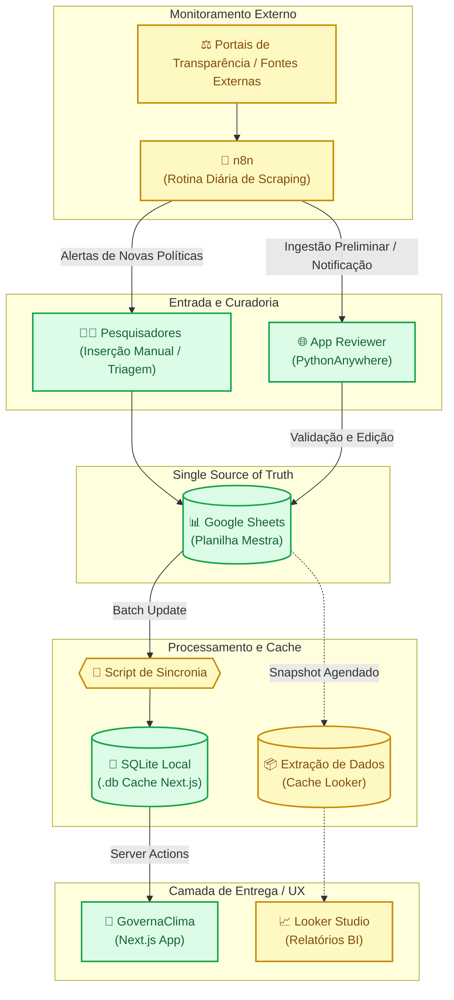
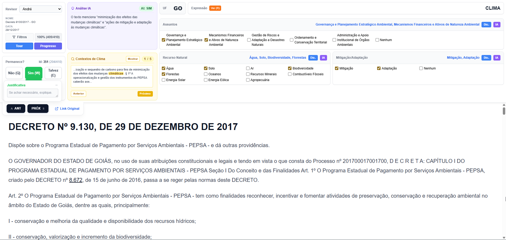
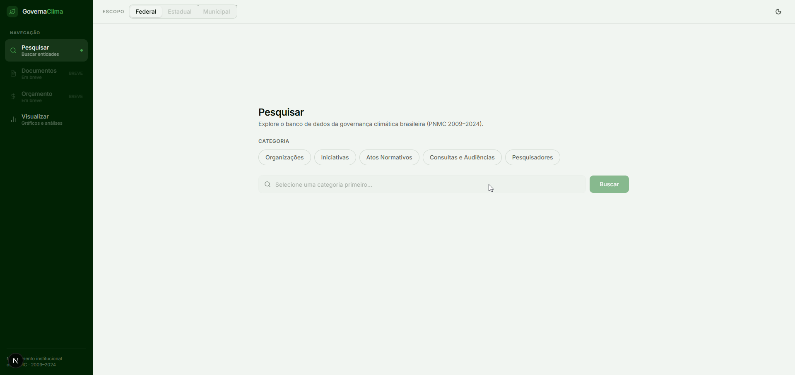
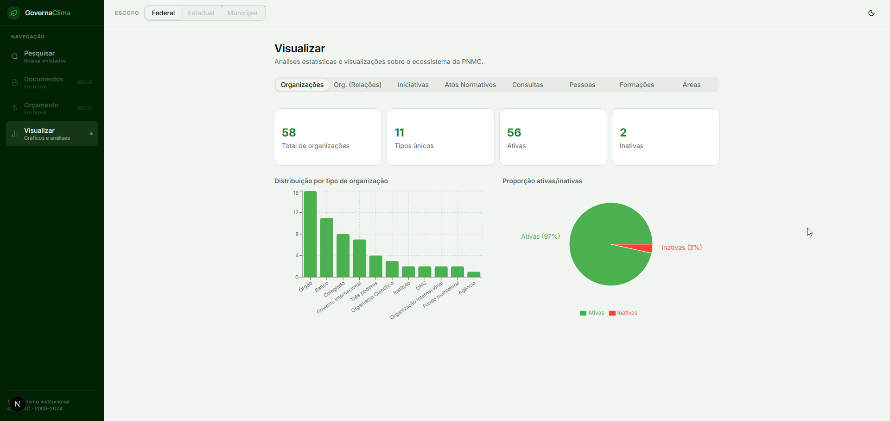
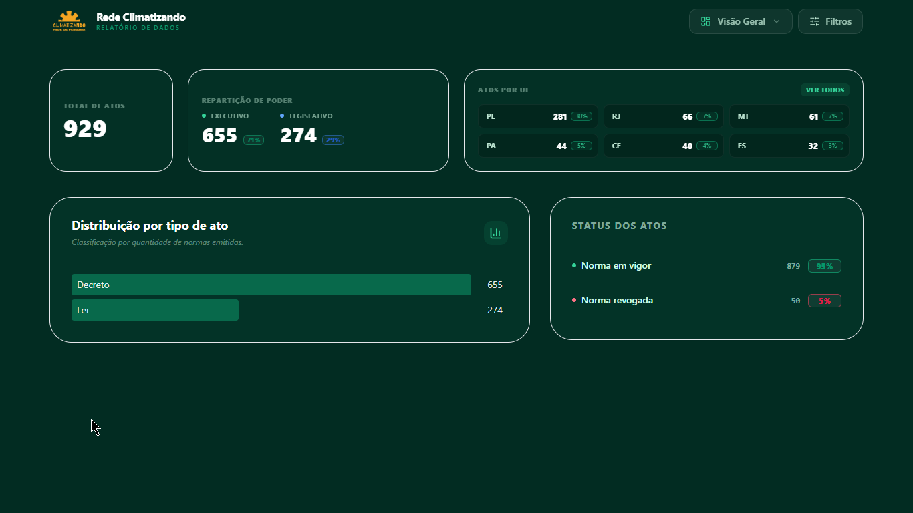
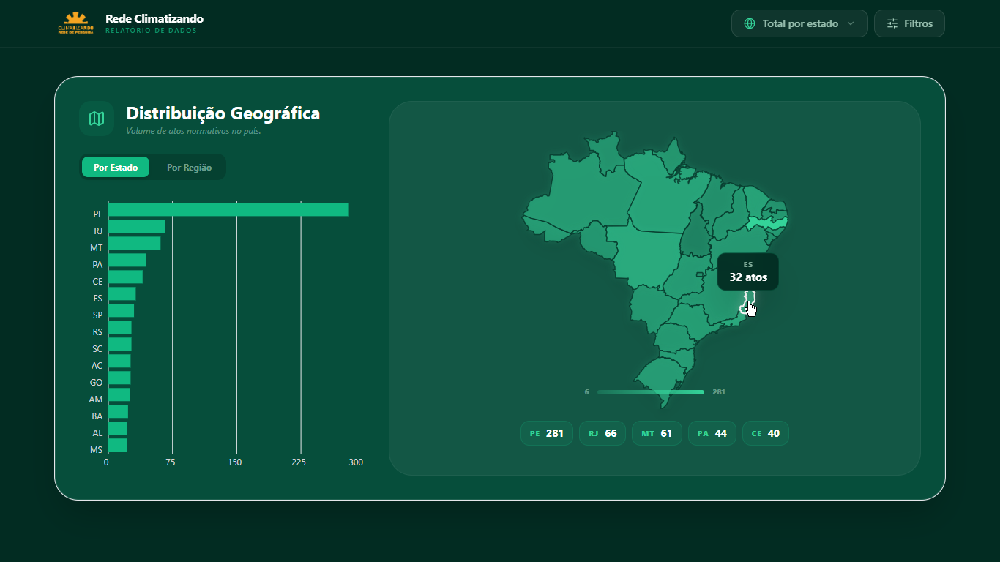
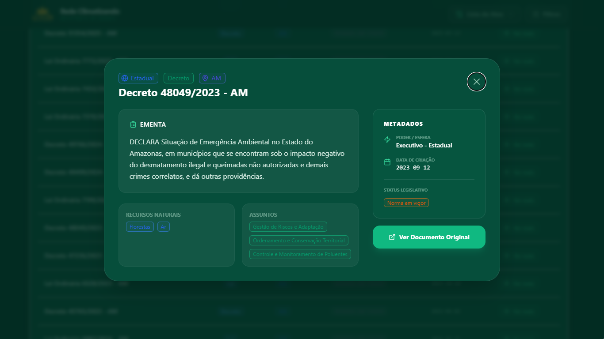

# Plano GovernaClima

> Dashboard interativo e plataforma de curadoria para o projeto **GovernaClima** em conjunto com a **Rede Climatizando**. Acompanhamento inteligente de Atos Normativos sobre Mitigação e Adaptação Climática no Brasil.

---

## 📑 Índice

1. [Sobre o Projeto](#sobre-o-projeto)
2. [Arquitetura e Fluxo de Dados (SSoT)](#arquitetura-e-fluxo-de-dados)
3. [Visualização do Ecossistema](#visualizacao)
4. [Guia de Estilo (Design System)](#guia-de-estilo)
5. [Tecnologias Utilizadas](#tecnologias)
6. [Como Executar o Projeto Localmente](#execucao)
7. [Scripts Auxiliares (Python)](#scripts)
8. [Roadmap e Planos Futuros](#roadmap)

---

## 🌐 <a name="sobre-o-projeto"></a>Sobre o Projeto

O **Climatizando Dash**/**GovernaClima** é a principal camada de visualização e análise bibliográfica iterativa para o corpo de pesquisadores da Rede Climatizando.\
Seu principal objetivo é viabilizar o estudo qualitativo e quantitativo unificado da evolução de normas, leis e decretos focados na agenda climática.

## 🏛️ <a name="arquitetura-e-fluxo-de-dados"></a>Arquitetura e Fluxo de Dados

A arquitetura moderna do projeto opera sob o conceito de **Single Source of Truth (SSoT)**, garantindo que os fluxos de escrita, validação e exibição sejam resilientes e de alta velocidade.

- **Fonte Oficial (Google Sheets):** A Planilha Mestra. Espaço principal onde os pesquisadores validam a base.
- **App Reviewer (`/climatizando-review`):** Aplicação de revisão hospedada no _PythonAnywhere_. Permite edição refinada e curadoria de registros antes da consolidação na planilha.
- **Sincronização e Cache Server-Side:** Através de scripts, o conteúdo da Planilha é importado gerando um banco **SQLite** (`database-climatizando.db`). O Next.js se conecta _exclusivamente_ a este SQLite via **Server Actions**, obtendo performance de carregamento e cruzamento de painéis virtualmente instantânea.
- **Camada Alternativa em BI:** Conectividade direta via Google Connector para o **Looker Studio**, cedendo autonomia total de montagem de BI para os próprios pesquisadores não-desenvolvedores.

---

## 🏗️ Plano de Reestruturação (Baseado na Pauta de 07/04)

Com base nas definições da reunião, os próximos passos do projeto deverão focar nestes 5 pontos prioritários:

### Centralização do Fluxo de Dados (Single Source of Truth/SSOT)

A reestruturação da arquitetura redefine o papel do **SQLite**: ele deixa de ser o banco de dados primário de escrita para se tornar uma **Camada de Sincronização e Cache Local**. Essa mudança garante a integridade dos dados sem sacrificar a velocidade de entrega da aplicação.

- **Ação Estrutural (SSoT):** A entrada oficial de dados e qualquer fluxo de edição passam a ser centralizados em uma **Planilha Mestra no Google Sheets**, que assume o papel de única "Fonte da Verdade" (Single Source of Truth). Isso elimina a fragmentação de dados e simplifica a governança.
- **Canais de Alimentação:** O fluxo de atualização da planilha ocorre através de dois eixos complementares:
    1.  **Inserção Manual:** Realizada diretamente pelos pesquisadores na interface do Google Sheets, aproveitando a familiaridade da ferramenta para entrada de dados em lote.
    2.  **App Reviewer (PythonAnywhere):** Interface especializada para validação e edição refinada. Este ambiente permite que os registros passem por uma curadoria técnica antes de serem consolidados na planilha mestra. Seu repositório é: ../climatizando-review

- **Mecanismo de Injeção de Dados:** O sistema utiliza uma rotina de sincronização (script Python) que extrai os dados validados do Google Sheets e reconstrói o arquivo `.db` do SQLite de forma limpa.

**Vantagem Técnica:** Com essa abordagem, a camada de visualização no **Next.js** permanece desacoplada da complexidade da API do Google. As _Server Actions_ continuam consultando o SQLite local, o que garante uma navegação instantânea para o usuário final, enquanto a gestão dos dados ganha a robustez e o versionamento do ecossistema Google Workspace.

### Estratégia de "Caminho Duplo" (GovernaClima + Looker Studio)

Para garantir autonomia aos grupos de pesquisa, o projeto foi arquitetado em duas camadas independentes de visualização, ambas enraizadas no Google Sheets. O esquema completo de conexão funcionará da seguinte maneira: As cores indicam o estágio atual de cada componente:

- 🟢 **Verde:** Implementado e Operacional.
- 🟡 **Amarelo:** Em desenvolvimento ou Planejado.



**Detalhando a otimização de performance:**

- **O papel do n8n no fluxo:**
    - **Automação de Descoberta:** O n8n executa rotinas diárias conectando-se a APIs de portais de transparência ou realizando _web scraping_ em diários oficiais.
    - **Conexão com Pesquisadores:** Ao detectar uma palavra-chave relevante (ex: "Mudança Climática", "Adaptação"), o n8n envia um alerta (via E-mail, Slack ou Telegram) para os pesquisadores iniciarem a triagem manual.
    - **Conexão com App Reviewer:** O n8n pode realizar uma "pré-inserção" de metadados básicos (título da norma, link, data) diretamente na interface de revisão, economizando tempo de digitação e permitindo que o pesquisador foque apenas na análise qualitativa antes de enviar para o Google Sheets.
- **Camada 1: Painel UFRGS (GovernaClima - Next.js):** Utiliza o SQLite como camada de cache local para garantir que a interface oficial responda em milissegundos, desacoplada da latência da API do Google.
- **Camada 2: Plataforma Looker Studio (Extração de Dados):** Para gerenciar o volume de ~5.600 registros e garantir que os filtros sejam instantâneos, **não utilizamos a conexão direta "ao vivo"**. Em vez disso, o Looker Studio utiliza o conector de **Extração de Dados**.
    - **Funcionamento:** O Looker cria um snapshot otimizado dos dados. Isso reduz o tempo de carregamento dos gráficos de segundos para uma fração de segundo.
    - **Atualização:** O cache é atualizado via snapshot agendado (ex: diariamente), garantindo que a Planilha Mestra continue sendo a única fonte de verdade (SSOT).

---

## 🖼️ <a name="visualizacao"></a>Visualização do Ecossistema

Acompanhamento visual das interfaces de curadoria e das propostas de dashboard para o projeto.

### 🔍 App Reviewer (Fronteira de Dados)

Interface de curadoria técnica que atua como ponte entre a descoberta automatizada (n8n) e a Planilha Mestra (SSoT).

<div align="center">
  
</div>

### 📊 Modelos de Dashboard (Em Decisão)

> **⚠️ IMPORTANTE:**
> Atualmente, as opções **GovernaClima (Vis)** e **Rede Climatizando** estão em fase de teste de usabilidade. O projeto final adotará **UM OU OUTRO** (ou uma síntese técnica de ambos), priorizando a experiência analítica dos pesquisadores.

#### Opção 1: GovernaClima (Visão Sintética)

Foco em painéis de métricas e filtros de acesso rápido.

<div align="center">
  
  
</div>

#### Opção 2: Rede Climatizando (Visão Geográfica e Analítica)

Foco em mapeamento de leis, listagem detalhada e fluxogramas sistêmicos.

<div align="center">
  
  
  
</div>

---

## 🎨 <a name="guia-de-estilo"></a>Guia de Estilo (Design System)

Para manter a consistência visual e o "look and feel" premium entre o Dashboard Next.js, o App Reviewer e os relatórios Looker, validamos as seguintes diretrizes:

### 1. Paleta de Cores

Mapeada via Tailwind (`tailwind.config.ts`) e folha de base (`globals.css`):

| Categoria             | Cor Hex   | Aplicação                                                |
| :-------------------- | :-------- | :------------------------------------------------------- |
| **Brand Principal**   | `#059669` | Identidade principal (Tremor default), Botões.           |
| **Brand (Emphasis)**  | `#047857` | Destaques interativos, Hover em botões.                  |
| **Background**        | `#f8fafc` | Fundo principal da aplicação (Global CSS).               |
| **Background Card**   | `#ffffff` | Fundo dos cards (`bg-white` na classe `.tremor-card`).   |
| **Foreground Global** | `#0f172a` | Texto principal da aplicação (Global CSS).               |
| **Content Strong**    | `#111827` | Títulos e elementos numéricos de destaque.               |
| **Content Default**   | `#6b7280` | Corpo de texto descritivo e legendas (`tremor.content`). |

### 2. Tipografia

- **Títulos e Descrições:** Família principal (`sans`) configurada com suporte moderno nativo do ecossistema Vercel/Next (e.g. Geist ou Inter).
- **Escalas (Tremor):** Implementado no Tailwind com suporte semântico para `tremor-default` (14px), `tremor-title` (18px) e `tremor-metric` (30px).

### 3. Componentes Tremor (UI)

As propriedades globais foram subscritas no CSS:

- **`tremor-card`**: Fundo branco, formato acolchoado (`p-6`), cantos `rounded-lg`, contorno sutil `border-slate-200` e uma sombra leve moderna (`shadow-sm`).
- **Sombras Padrão:** O design propõe sobreposição 3D macia nos objetos (e.g. `0 1px 3px 0 rgb(0 0 0 / 0.1)`).

### 4. Iconografia

Trama construída via pacote **Lucide React**. Segue com _stroke_ rígido de `2px` provendo um feeling conciso. Tamanhos de interface: `18px` para menus ordinários, `24px` para destaques de módulo.

---

## 💻 <a name="tecnologias"></a>Tecnologias Utilizadas

A Stack foi selecionada voltada para Tipagem, Produtividade React e Alta Performance de Carregamento.

- **Core & Roteamento:** Next.js 15+ (`App Router`)
- **Linguagem Subjacente:** TypeScript
- **Estilo & Componentes Gráficos:** Tailwind CSS, Tremor React, e Headless UI
- **Animações (Micro-interações):** Framer Motion
- **Banco e Persistência de Cache:** `better-sqlite3` local.

---

## 🛠️ <a name="execucao"></a>Como Executar o Projeto Localmente

1. **Clone o repósitório**

    ```bash
    git clone <URI_DO_REPOSITORIO>
    cd climatizando-dash
    ```

2. **Instalação das Dependências**
   O projeto utiliza os pacotes gerenciados via arquivo `package.json`.

    ```bash
    npm install
    # ou
    bun install
    ```

3. **Iniciar Ambiente de Desenvolvimento**
   Suba o servidor em ambiente local:
    ```bash
    npm run dev
    ```
    > 🔗 **Pronto:** Acesse sua aplicação abrindo [http://localhost:3000](http://localhost:3000) no seu navegador. Os dados do banco SQLite local de referência `database-climatizando*.db` serão providos e renderizados instantaneamente mediante as Server Actions.

---

## 🐍 <a name="scripts"></a>Scripts Auxiliares

Existem pacotes auxiliares na própria base para gerenciar arquivos brutos e automações de laboratório:

- **📄 `generate_docx.py`**: Lógica implementada em Python dedicada a ler diretamente o banco `.db` e montar compêndios estruturados em `.docx` para anexar fisicamente ou embasar os relatórios das agências ambientais.
- **📦 `package_project.py`**: Automatiza a compactação limpa da aplicação principal contornando builds e pesados `node_modules`.

_**Dica:** Para rodar os scripts, verifique e instale o ambiente Python usando as dependências base do projeto:_
`pip install -r requirements.txt`

---

## 🚀 <a name="roadmap"></a>Roadmap e Planos Futuros

Conforme alinhamento em andamento de reestruturação do grupo, os próximos épicos abrangem:

1. Habilitar sincronização 100% contínua com a **Planilha Mestra Centralizada**.
2. Amadurecimento do modelo de curadoria via interface modular (**App Reviewer**).
3. Produção do _Manual de Integração_ definitivo empoderando não-devs a cruzar dados do projeto com a API do Google Looker Studio.
4. Estruturar "filtros refinados" e relatórios base para extração voltados à base do **Artigo Dossiê** quantitativo do projeto.

---

_Desenvolvido com dedicação contínua para modernizar o rastreio da Agenda Climática._
